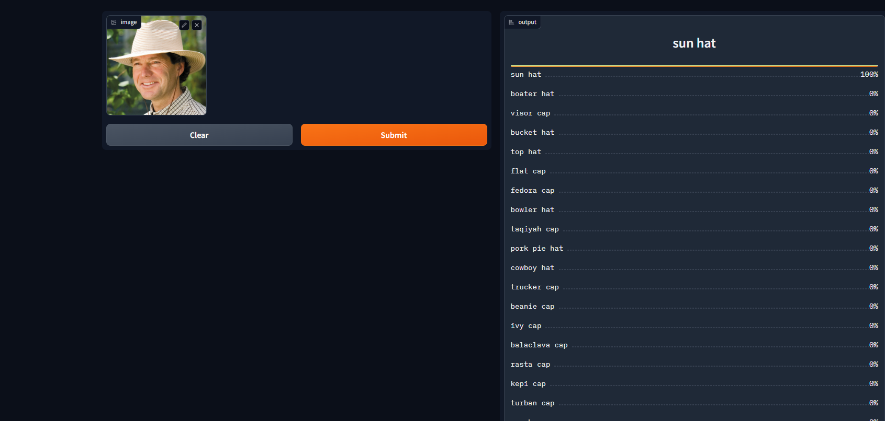

# caprecognizer
An image classification model from cleaning, data collection, model training, deployment and API integration. 
The model can classify 20 different types of caps and they are:  
1. balaclava cap
2. baseball cap
3. beanie cap
4. boater hat
5. bowler hat
6. bucket hat
7. cowboy hat
8. edora cap
9. flat cap
10. ivy cap
11. kepi cap
12. newsboy cap
13. pork pie hat
14. rasta cap
15. sun hat
16. taqiyah cap
17. top hat
18. trucker cap
19. turban cap
20. visor cap

# Data processing and construction
**Data Gathering**: Download from DuckDuckgo using term name  
**DataLoader**: Used fastai DataBlock API to set up the Dataloader  
**Data Augmentation**: fastai provides default augmentation which operates in GPU  
# Training and Cleaning
**Training**: Fined tuned a resnet34 model for 5 epochs (3 times) and got ~89% accuracy.  
**Data Cleaning**: This part took me the highest time. Since I collected data from Google Images, there were many noises. Also, some images contained animation and CGI, which is not my goal right now for this project. I cleaned and updated data using fastai ImageClassifierCleaner. I cleaned the data each time after training or fine-tuning, except for the last time which was the final iteration of the model 

# Model Deployment
I deployed to model to HuggingFace Spaces Gradio App. The implementation can be found in `documentation` or [here](https://huggingface.co/spaces/Faiyaz10/Cap_recognizer) 

# API integration with Github Pages
The deployed model API is integrated into [here](https://faiyaz-zaman.github.io/caprecognizer/) in Github Pages Website, implementations can be found in `docs` folder.
